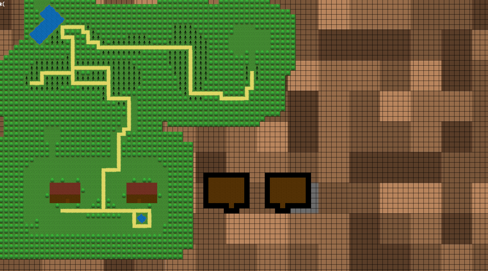

<!-- PROJECT LOGO -->
<br />
<p align="center">
  <a href="https://github.com/nicklamyeeman/my_rpg">
    
  </a>

  <h3 align="center">RPG</h3>

  <p align="center">
    Play FF42 the end-of-year project of my first year at Epitech 
    <br />
    <a href="https://github.com/nicklamyeeman/my_rpg"><strong>Explore the docs »</strong></a>
    <br />
    <br />
    <a href="https://github.com/nicklamyeeman/my_rpg/issues">Report Bug</a>
    ·
    <a href="https://github.com/nicklamyeeman/my_rpg/issues">Request Feature</a>
  </p>
</p>


<!-- TABLE OF CONTENTS -->
## Table of Contents

* [About the Project](#about-the-project)
  * [Built With](#built-with)
* [Getting Started](#getting-started)
  * [Prerequisites](#prerequisites)
  * [Installation](#installation)
* [Usage](#usage)
* [Roadmap](#roadmap)
* [Contributing](#contributing)
* [Contact](#contact)
* [Acknowledgements](#acknowledgements)


<!-- ABOUT THE PROJECT -->
## About The Project

This project brings together all the skills acquired during the first year at Epitech. 
Realized in team this RPG takes again mechanics of Pokémon (Damage dealing, experience and leveling, basically all the maths and stats are fully inspired by Pokémon) and Final Fantasy (Aspect, game mechanics). The game in entirely in French and don't have any option to change language (sorry)

### Built With

* [CSFML](https://github.com/SFML/CSFML)


<!-- GETTING STARTED -->
## Getting Started

To get a local copy up and running follow these simple steps.

### Prerequisites

Be sure you have CSFML installed on your PC, then open a terminal

### Installation

1. Clone the repo
```sh
git clone https://github.com/nicklamyeeman/my_rpg.git
```
2. Compile it
```sh
make
```


<!-- USAGE -->
## Usage

### Example

```sh
./my_rpg
```


Menu page:
<br/>


Navigate throught the menu with your mouse and click on the option you want


Move around using :
             <kbd>Z</kbd>
<kbd>Q</kbd> <kbd>S</kbd> <kbd>D</kbd>


Use <kbd>E</kbd> to interact with pnj in the world


Use <kbd>ESC</kbd> to open your in-game menu and navigate with your arrow keys : 
             <kbd>↑</kbd>
<kbd>←</kbd> <kbd>↓</kbd> <kbd>→</kbd>

To validate any option use <kbd>Enter↲</kbd>


In the game you will fall randomly into battle against ennemies with a scaling level


Fight is turn-by-turn based and have random events like missing, critical strike or chances to run away


Fights allow single attack, damaging spells, heal spells and any victory give your team experience.


Each level progressively increase stats of each characters in your team


Now you can try to find the boss and kick his a** ! 


### BONUS N°1 : MAP MAKER

```sh
cd bonus/map_maker/
make
./map_maker
```



Map maker is a small program that allows you to create your own map and then save it to reuse it in our rpg by replacing the content of ```maps/.map``` file by your map.

Here's are the instructions to use map_maker properly : 
- Lauch the binary with no parameters
- Type with the keyboad, the name of a texture located in the ```texture/``` directory
- Press enter
- Draw using Left click
- Erase using Right click
- Feel free to change your texture at any moment by typing the new one

Additionnal commands :
- SAVE [FILENAME]
- LOAD [FILENAME]
- CLEAR
- SPAWN (Draw a spawn area where the player can encounter a fight while walking on it)


### BONUS N°2 : RPG SIMULATOR

```sh
cd bonus/rpg_simulator/
make
./rpg_simulator
```

RPG Simulator is a small program that simulate the fight mechanic in the rpg game in a terminal version (in French once again, I'm sorry).
All maths are fully inspired by the [Pokémon Damage system](https://bulbapedia.bulbagarden.net/wiki/Damage)


You just have to type whatever you want to do in the actual context


<!-- ROADMAP -->
## Roadmap

See the [open issues](https://github.com/nicklamyeeman/my_rpg/issues) for a list of proposed features (and known issues).


<!-- CONTRIBUTING -->
## Contributing

Contributions are what make the open source community such an amazing place to be learn, inspire, and create. Any contributions you make are **greatly appreciated**.

1. Fork the Project
2. Create your Feature Branch (`git checkout -b feature/AmazingFeature`)
3. Commit your Changes (`git commit -m 'Add some AmazingFeature'`)
4. Push to the Branch (`git push origin feature/AmazingFeature`)
5. Open a Pull Request

We were 5 originally on this project : 
 - LAM YEE MAN Nick
 - DEMEESTER Alexandre
 - DEMOL Axel
 - HOARAU Alexandre
 - CHAN YEN MAN Garance


<!-- CONTACT -->
## Contact

Nick LAM YEE MAN - [@nickauteen](https://twitter.com/nickauteen) - nick.lam-yee-man@epitech.eu

Project Link: [https://github.com/nicklamyeeman/my_rpg](https://github.com/nicklamyeeman/my_rpg)


<!-- ACKNOWLEDGEMENTS -->
## Acknowledgements

* [Best-README Template](https://github.com/othneildrew/Best-README-Template)


<!-- MARKDOWN LINKS & IMAGES -->
<!-- https://www.markdownguide.org/basic-syntax/#reference-style-links -->
[contributors-shield]: https://img.shields.io/github/contributors/nicklamyeeman/repo.svg?style=flat-square
[contributors-url]: https://github.com/nicklamyeeman/repo/graphs/contributors
[forks-shield]: https://img.shields.io/github/forks/nicklamyeeman/repo.svg?style=flat-square
[forks-url]: https://github.com/nicklamyeeman/repo/network/members
[stars-shield]: https://img.shields.io/github/stars/nicklamyeeman/repo.svg?style=flat-square
[stars-url]: https://github.com/nicklamyeeman/repo/stargazers
[issues-shield]: https://img.shields.io/github/issues/nicklamyeeman/repo.svg?style=flat-square
[issues-url]: https://github.com/nicklamyeeman/repo/issues
[license-shield]: https://img.shields.io/github/license/nicklamyeeman/repo.svg?style=flat-square
[license-url]: https://github.com/nicklamyeeman/repo/blob/master/LICENSE.txt
[linkedin-shield]: https://img.shields.io/badge/-LinkedIn-black.svg?style=flat-square&logo=linkedin&colorB=555
[linkedin-url]: https://linkedin.com/in/nicklamyeeman
[product-screenshot]: images/screenshot.png